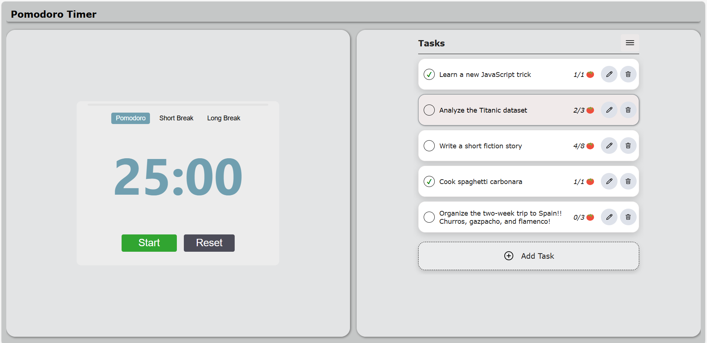

# Pomodoro Timer and Task Manager

This is a time and task management application based on the Pomodoro technique. The goal is to help users focus on their tasks.

📌 The project is in progress, but it is already functional.

## ⏰ What is the Pomodoro Technique?

The **Pomodoro Technique** is a time management method created by Francesco Cirillo to improve productivity during work and study. The method divides work time into typically 25-minute intervals dedicated to focusing on a task, followed by short breaks of 5 minutes. After four pomodori, a longer break of around 15 minutes is taken.

## 🚀 How to Use?

1. Add tasks with a name and the estimated number of pomodori you think you will need to complete them. A pomodoro is a 25-minute interval.
2. Select a task.
3. Start the timer.
4. Focus on the task for 25 minutes.
5. When the timer ends, the application automatically switches to the break interval.
6. Repeat the process as many times as needed.

## ✨ Features

- Start/Pause the timer.
- Reset the timer.
- View the timer progress bar.
- Add tasks with names and estimated number of pomodori.
- Edit tasks (name and estimated pomodori).
- Delete tasks.
- Complete pomodori and mark tasks as done.
- Hide/Show completed tasks.
- View progress of each task (completed / estimated pomodoros ).
- Drag and drop tasks to reorder (in process).
- Persistent storage using Local Storage.

## 💻 Technologies Used

- HTML5
- CSS3
- JavaScript (Vanilla JS)

## 📁 Project Structure

- [`index.html`](index.html): main file that structures the app content
- [`styles/`](styles): folder containing stylesheets
  - [`general.css`](styles/general.css): global layout and shares styles
  - [`timer.css`](styles/timer.css): styles specific to the timer
  - [`tasks.css`](styles/tasks.css): styles specific to the ToDo list
- [`scripts/`](scripts): folder containing JavaScript code
  - [`tasks/`](scripts/tasks): folder with logic and components related to the task list
    - [`taskDrag.js`](scripts/tasks/taskDrag.js): handles dragging and reordering tasks
    - [`tasksMenu.js`](scripts/tasks/tasksMenu.js): manages the dropdown menu to show/hide or clear all tasks or only completed ones
    - [`tasksModel.js`](scripts/tasks/tasksModel.js): stores data related to tasks, with functions for adding, editing, or deleting tasks
    - [`tasksView.js`](scripts/tasks/tasksView.js): generates and renders the HTML for the task list
  - [`timer/`](scripts/timer): folder with logic and components related to the timer
    - [`timerEvents.js`](scripts/timer/timerEvents.js): handles user events for the timer (Start/Pause, Reset, and phase changes buttons)
    - [`timerLogic.js`](scripts/timer/timerLogic.js): contains the internal timer logic, like calculating remaining time and managing phase changes
- [`assets/`](assets): folders containing project resources
  - [`icons/`](assets/icons): icons (SVG)
  - [`audio/`](assets/audio): audio files (mp3)
    - [`timer-sound.mp3`](assets/audio/timer-sound.js): audio that plays at the end of each countdown (Sound Effect by [ALEXIS_GAMING_CAM](https://pixabay.com/es/users/alexis_gaming_cam-50011695/?utm_source=link-attribution&utm_medium=referral&utm_campaign=music&utm_content=342934) from [Pixabay](https://pixabay.com//?utm_source=link-attribution&utm_medium=referral&utm_campaign=music&utm_content=342934))
  - [`images/`](assets/images): images (PNG)

## ⚡ Installation

1. Download or clone the repository.
  `git clone https://github.com/AlvaroLC24/pomodoro-todo-app.git`
2. Go into the project folder
  `cd todo-timer-project`
3. Run the web app on a local server.

## 💯 Future Improvements

- Add a timer history to track completed pomodoros and total focused time.
- Include productivity statistics (daily, weekly, or monthly) with charts.
- Integrate a backend for saving data and syncing tasks across devices.
- Implement user registration/login.
- Send notifications when the timer ends or a task is completed.
- Add unit and integration tests.
- Optimize and modularize code for better maintainability.
- Add a theme toggle button.
- Include a Lofi or instrumental background music playlist with play/pause controls.

---

**Author:** Álvaro López